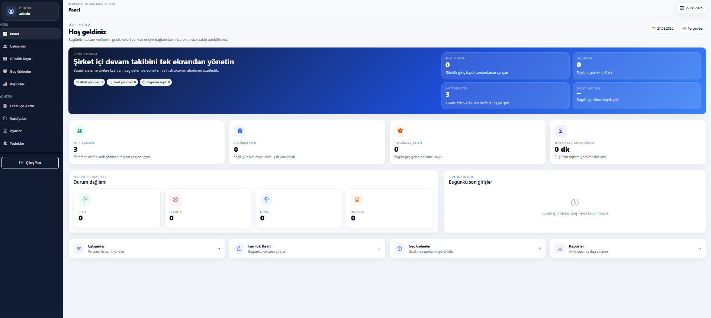
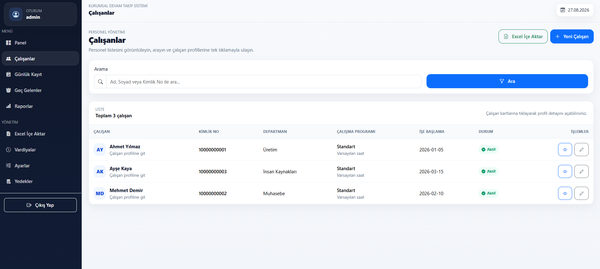
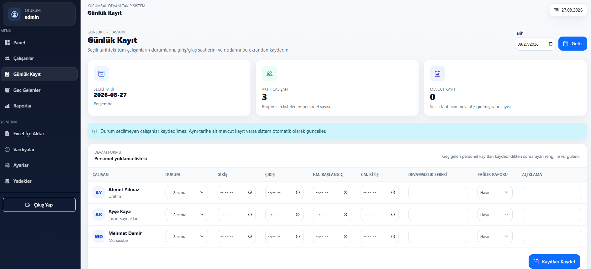
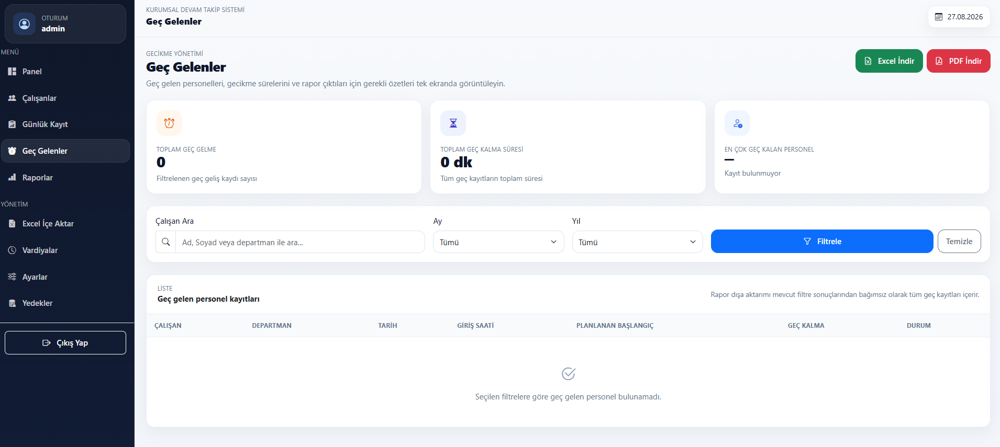
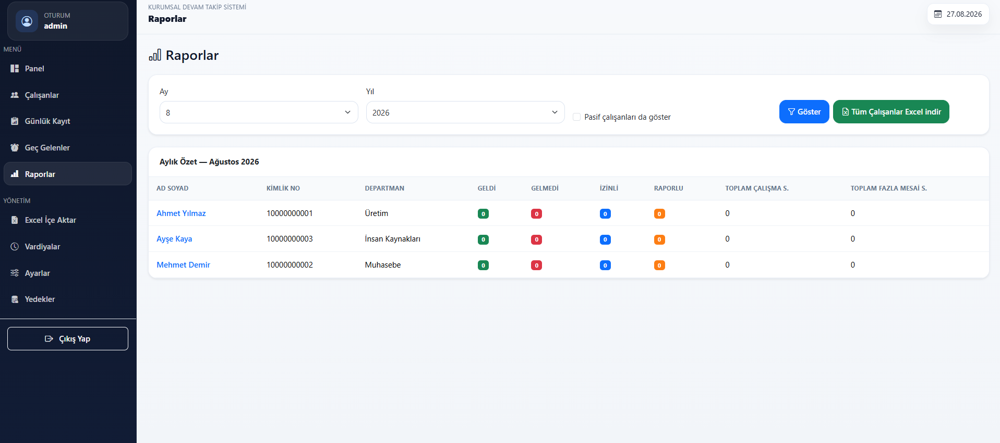
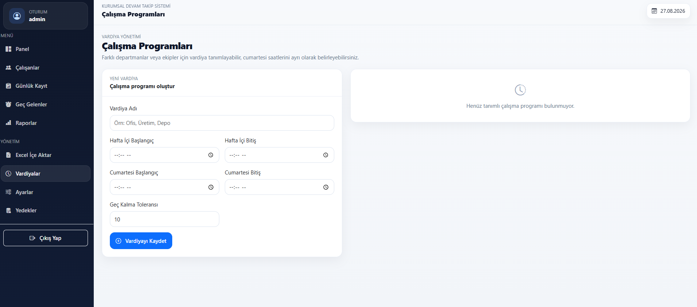
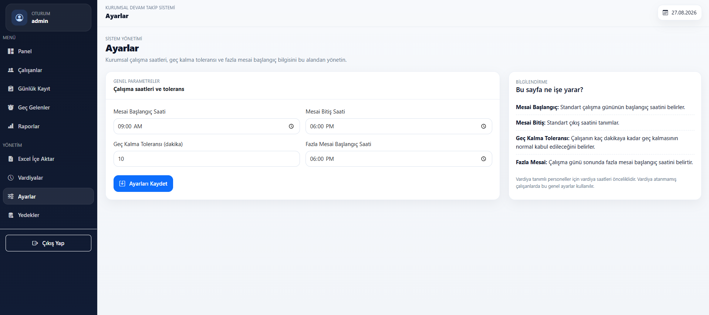
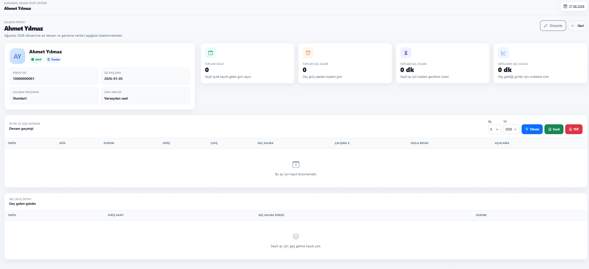
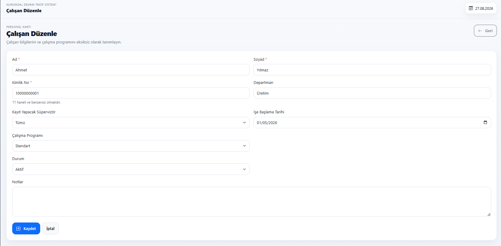

# 👥 Personel Devam ve Devamsızlık Yönetim Sistemi

<p align="center">
  <a href="README.md">English</a> | <b>Türkçe</b>
</p>


**Node.js, Express ve EJS** ile geliştirilmiş rol tabanlı bir **personel devam/devamsızlık, çalışma saati, fazla mesai ve operasyonel raporlama sistemi**dir. Proje, veritabanı sunucusuna ihtiyaç duymadan çalışabilen hafif bir iş uygulaması olarak tasarlanmış ve operasyonel veriler yapılandırılmış JSON dosyalarında saklanmıştır.

Uygulama; çalışan yönetimi, günlük devam kaydı, giriş/çıkış takibi, geç kalma tespiti, fazla mesai hesaplama, vardiyalar, raporlar, Excel/PDF çıktıları, audit log, ayarlar ve yedekleme/geri yükleme süreçlerini tek sistemde birleştirir.

## 🖥️ Uygulama Görselleri

### Panel
Merkezi yönetim paneli; aktif çalışanları, günlük kayıtları, geç gelenleri, kayıt bekleyen personeli ve son girişleri tek ekranda özetler.

<p align="center">
  
</p>

### Çalışan Yönetimi ve Günlük Kayıt
Çalışan listesinde arama, profil görüntüleme, durum bilgisi ve düzenleme işlemleri bulunur. Günlük kayıt ekranında devam durumu, giriş/çıkış, fazla mesai, devamsızlık sebebi, sağlık raporu ve açıklama bilgileri tek tablodan yönetilir.

<p align="center">
  
  
</p>

### Geç Gelenler ve Aylık Raporlar
Geç gelen personel çalışan, ay ve yıl bazında filtrelenebilir; sonuçlar Excel/PDF olarak dışa aktarılabilir. Aylık rapor ekranı tüm çalışanların devam durumlarını, çalışma saatlerini ve fazla mesailerini özetler.

<p align="center">
  
  
</p>

### Çalışma Programları ve Sistem Ayarları
Admin, hafta içi ve cumartesi çalışma saatlerini, vardiya bazlı geç kalma toleransını ve genel mesai/fazla mesai saatlerini yönetebilir.

<p align="center">
  
  
</p>

### Çalışan Profili
Her çalışan için aylık devam geçmişi, geç kalma istatistikleri, çalışma saati özetleri ve çalışan bazlı Excel/PDF dışa aktarma seçenekleri bulunan detaylı profil sayfası vardır.

<p align="center">
  
</p>

<details>
<summary><b>Çalışan düzenleme ekranı</b></summary>
<br>
<p align="center">
  
</p>
</details>

## ✨ Temel Özellikler

### Çalışan Yönetimi
- Yeni çalışan ekleme ve çalışan bilgilerini düzenleme
- Ad, soyad veya kimlik numarasıyla arama
- Çalışanı aktif / pasif yapma
- Devam geçmişi olmayan çalışanı silme
- Aylık devam ve geç kalma özetleri içeren çalışan profil sayfası
- Çalışana çalışma programı ve süpervizör atama
- `.xlsx` dosyasından çalışan içe aktarma

### Devam / Devamsızlık
- Günlük devam kayıt ekranı
- Durumlar: **Geldi**, **Gelmedi**, **İzinli**, **Raporlu**
- Giriş ve çıkış saati takibi
- Aynı çalışan + aynı tarih için mükerrer kayıt engelleme
- Önceden kaydedilmiş devam kayıtlarını düzenleme
- Açıklama, devamsızlık sebebi ve sağlık raporu bilgileri
- Süpervizör yetkisine göre sınırlı operasyonel kayıt akışı

### Çalışma Saati, Fazla Mesai ve Geç Kalma
- Otomatik çalışma saati hesaplama
- Fazla mesai başlangıç/bitiş ve toplam fazla mesai hesaplama
- Genel çalışma saati veya atanmış vardiyaya göre geç kalma tespiti
- Ayarlanabilir geç kalma toleransı
- Cumartesi için ayrı vardiya saatleri
- Toplam gecikme dakikaları ve çalışan özetleri

### Vardiyalar, Tatiller ve Ayarlar
- Çalışma programı / vardiya tanımlama
- Hafta içi ve cumartesi çalışma saatleri
- Vardiya bazlı geç kalma toleransı
- Tatil tarihi yönetimi
- Genel çalışma başlangıç/bitiş ayarları
- Genel fazla mesai başlangıç saati ayarı

### Raporlama ve Dışa Aktarma
- Çalışan bazlı aylık devam raporu
- Tüm çalışanlar için aylık genel özet
- Geldi / Gelmedi / İzinli / Raporlu toplamları
- Toplam çalışma ve fazla mesai saatleri
- Geç kalma raporları
- **ExcelJS** ile Excel çıktıları
- **PDFKit** ile PDF çıktıları
- Türkçe PDF metni için platformlar arası Unicode font bulma desteği

### Yedekleme ve Audit Log
- Önemli değişikliklerden önce otomatik yedek
- Manuel yedek oluşturma
- Mevcut yedekten geri yükleme
- Geri yükleme öncesi güvenlik yedeği
- Çalışanlar, devam kayıtları, audit log, vardiyalar, ayarlar ve tatiller için yedekleme
- Önemli sistem işlemlerinin audit log kayıtları

## 👤 Roller ve Yetkiler

### Admin
Admin; panel, çalışan yönetimi, Excel içe aktarma, devam kayıtları, raporlar, geç kalma analizi, yedekler, ayarlar, vardiyalar ve tatiller dahil sistemin tüm yönetim bölümlerine erişebilir.

### Supervisor
Süpervizör rolü operasyonel devam akışıyla sınırlandırılmıştır. Süpervizör panel ve kendisine görünür çalışanların devam kayıt ekranına erişebilir; admin bölümleri **403 Forbidden** döndürür.

## 🧰 Kullanılan Teknolojiler

| Teknoloji | Kullanım |
|---|---|
| Node.js | Sunucu tarafı çalışma ortamı |
| Express | Routing ve HTTP uygulama katmanı |
| EJS | Sunucu tarafında oluşturulan arayüzler |
| express-ejs-layouts | Ortak sayfa düzeni |
| express-session | Session tabanlı kimlik doğrulama |
| JSON dosyaları | Hafif veri saklama |
| ExcelJS | Excel içe aktarma ve rapor üretimi |
| PDFKit | PDF rapor üretimi |
| Multer | Geçici Excel dosyası yükleme |
| Bootstrap / özel CSS | Responsive arayüz |
| Vanilla JavaScript | Ön yüz etkileşimleri |

## 🏗️ Uygulama Mimarisi

```text
├── server.js
├── middleware/
│   └── auth.js
├── routes/
│   ├── auth.js
│   ├── employees.js
│   ├── attendance.js
│   ├── reports.js
│   ├── backups.js
│   ├── import.js
│   ├── late.js
│   ├── settings.js
│   ├── shifts.js
│   └── holidays.js
├── storage/
│   ├── fileStorage.js
│   └── backup.js
├── utils/
│   ├── auditLog.js
│   ├── calculationUtils.js
│   ├── dateUtils.js
│   ├── exportExcel.js
│   ├── exportPdf.js
│   ├── fontUtils.js
│   └── lateUtils.js
├── views/
├── public/
├── docs/
└── data/
```

## 💾 Veri Saklama Modeli

Proje bilinçli olarak **MySQL, PostgreSQL, MongoDB veya SQLite gerektirmez**. Hafif bir iş sistemi mimarisini göstermek için yerel JSON dosyaları kullanır.

Veri saklama katmanı; eksik dosyaları otomatik oluşturma, güvenli JSON okuma, geçici dosya + rename ile atomik yazma, benzersiz ID üretimi, bozuk veri dosyasını sessizce ezmeden hata verme ve zaman damgalı yedek klasörleri özelliklerini içerir. Büyük ve çok kullanıcılı production ortamında transactional bir veritabanına geçmek önerilir.

## 🔐 Kimlik Doğrulama ve Güvenlik

Bu açık repository portföy için güvenli hale getirilmiştir:

- Gerçek `.env` dosyası Git'e dahil edilmez
- Production parola veya credential repository içinde tutulmaz
- Giriş bilgileri environment variable üzerinden alınır
- `SESSION_SECRET` zorunludur
- `data/users.json` parola içermez
- Yedek dosyaları Git'e dahil edilmez
- Excel yüklemeleri geçicidir, yalnızca `.xlsx` kabul edilir, dosya boyutu sınırlandırılır ve işlem sonrası silinir
- Rol tabanlı yetkilendirme yönetim route'larını korur

Production kullanımında parola hashleme, kalıcı session store, CSRF koruması, rate limiting, HTTPS üzerinde secure cookie ve veritabanı tabanlı kullanıcı modeli önerilir.

## 🌐 Environment Variables

`.env.example` dosyasını `.env` olarak kopyalayıp yerel değerlerinizi girin:

```env
ADMIN_USERNAME=admin
ADMIN_PASSWORD=guvenli_admin_parolasi
SUPERVISOR_USERNAME=supervisor
SUPERVISOR_PASSWORD=guvenli_supervisor_parolasi
SESSION_SECRET=uzun_rastgele_session_secret
PORT=3000
```

İsteğe bağlı PDF font ayarları:

```env
PDF_FONT_PATH=/unicode/font/dosyasinin/tam/yolu.ttf
PDF_FONT_BOLD_PATH=/unicode/bold/font/dosyasinin/tam/yolu.ttf
```

Sistem ayrıca Windows, Linux ve macOS üzerindeki yaygın Unicode font konumlarını otomatik arar; böylece Türkçe PDF karakterleri tipik ortamlarda doğru görünür.

## 🚀 Kurulum ve Çalıştırma

```bash
git clone https://github.com/safialajati2-creator/employee-attendance-management-system.git
cd employee-attendance-management-system
npm install
```

Environment dosyasını oluşturun:

```bash
cp .env.example .env
```

Windows PowerShell:

```powershell
Copy-Item .env.example .env
```

`.env` değerlerini düzenledikten sonra:

```bash
npm start
```

Tarayıcıdan `http://localhost:3000` adresini açın.

## 📥 Excelden Çalışan İçe Aktarma Formatı

İlk çalışma sayfası okunur ve ilk satır başlık kabul edilir.

| Sütun | Değer |
|---|---|
| A | 11 haneli kimlik numarası |
| B | Ad |
| C | Soyad |
| D | Departman |
| E | İşe başlangıç tarihi |
| F | Not |

Geçersiz, eksik veya tekrar eden satırlar atlanır ve sonuç ekranında raporlanır.

## 📊 Raporlama Detayları

**Çalışan Aylık Excel / PDF**; tarih/gün, devam durumu, giriş/çıkış, çalışma saati, fazla mesai, devamsızlık sebebi, sağlık raporu ve not bilgilerini içerir.

**Genel Aylık Excel**, seçilen ay/yıl için çalışan bazlı toplamları verir.

**Geç Kalma Excel / PDF**, çalışan, departman, tarih, gerçek giriş saati, planlanan başlangıç ve gecikme dakikasını içerir.

## ✅ Yapılan Kontroller

Portföy sürümünde ana akışlar smoke test ile kontrol edilmiştir:

- Doğru ve hatalı giriş
- Giriş yapılmadan ana sayfaya erişimde login yönlendirmesi
- Admin paneli ve admin sayfaları
- Supervisor panel ve devam kayıt erişimi
- Supervisor için admin bölümlerinde `403` kontrolü
- Çalışan ekleme / görüntüleme / güncelleme / aktif / pasif işlemleri
- Günlük devam kaydı oluşturma ve düzenleme
- Çalışan aylık Excel ve PDF çıktıları
- Genel aylık Excel raporu
- Geç kalma Excel ve PDF raporları
- Türkçe karakter destekli PDF çıktısı
- Ayar güncelleme
- Vardiya oluşturma
- Tatil oluşturma
- Manuel yedek oluşturma ve geri yükleme doğrulaması
- Excelden çalışan içe aktarma
- 404 sayfası
- JavaScript syntax kontrolü
- EJS template compile kontrolü

## ⚠️ Portföy / Production Kapsamı

Bu repository, gerçek iş süreçlerinin ve uygulama mimarisinin nasıl tasarlandığını göstermek amacıyla hazırlanmıştır. Portföy ve yerel/dahili demonstrasyon için uygundur; ek production hardening yapılmadan tamamlanmış enterprise HR platformu olarak değerlendirilmemelidir.

## 🎯 Proje Amacı

Bu proje; **Node.js backend geliştirme, Express routing, EJS arayüz geliştirme, kimlik doğrulama ve yetkilendirme, iş kuralları, dosya tabanlı veri saklama, devam hesaplamaları, Excel/PDF raporlama, veri içe aktarma, audit log, yedekleme/geri yükleme ve operasyonel iş sistemi tasarımı** becerilerini göstermeyi amaçlar.

## Geliştirici

Software Developer

[GitHub](https://github.com/safialajati2-creator) · [LinkedIn](https://www.linkedin.com/in/mustafa-alajati-8a1aa4286/?isSelfProfile=true) · [Email](mailto:Safialajati2@gmail.com)
